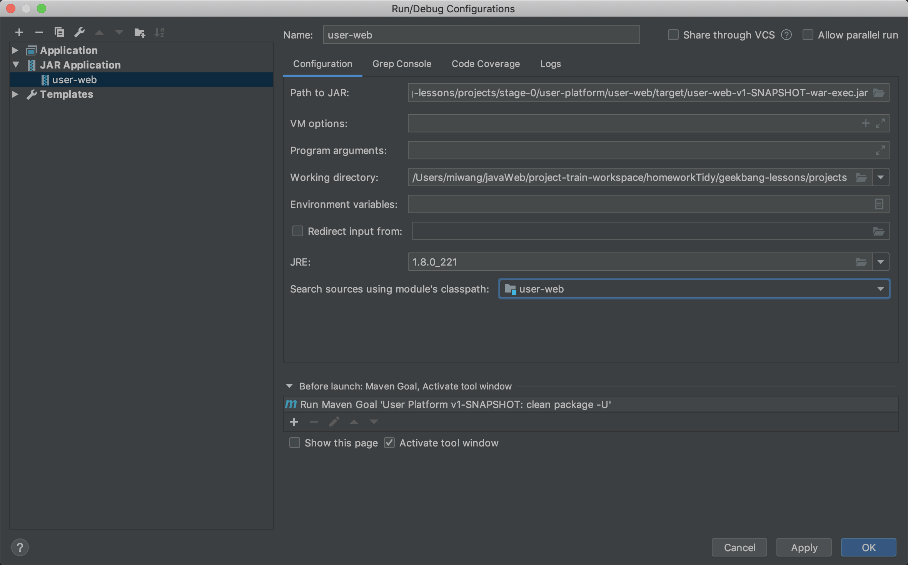

# week01

- [x] 通过自研 Web MVC 框架实现（可以自己实现）一个用户注册，forward 到一个成功的页面（JSP 用法）
    - /register
- [x] 通过 Controller -> Service -> Repository 实现（数据库实现）
- [ ] （非必须）JDNI 的方式获取数据库源（DataSource），在获取 Connection

### 作业完成

#### 配置项目

mac 下 修改 为相对路径

```
jdbc:derby:db/user-platform;create=true
```

配置项目使用jar启动



```
进入目录/Users/miwang/javaWeb/project-train-workspace/homeworkTidy/geekbang-lessons/projects/stage-0/user-platform/

java -jar user-web/target/user-web-v1-SNAPSHOT-war-exec.jar
```

或者配置项目使用tomcat启动


### 问题记录

使用IDEA新创建的login.jsp无法正常访问，报错如下。


根据异常信息提示，在 FrontControllerServlet.java:160 添加断点


据上图可知，报错原因是 login.jsp 中出现非法的contentType，查看代码，发现此处是由IDEA创建jsp页面时自动生成的。与我们引入的公共的head中的contentType冲突导致的。

```
<jsp:directive.include file="/WEB-INF/jsp/prelude/include-head-meta.jspf" />
```


所以，删除掉冲突代码和无用的注释，重新启动tomcat，就可以正常访问页面了。当然，其他页面一律按此修改一下。

